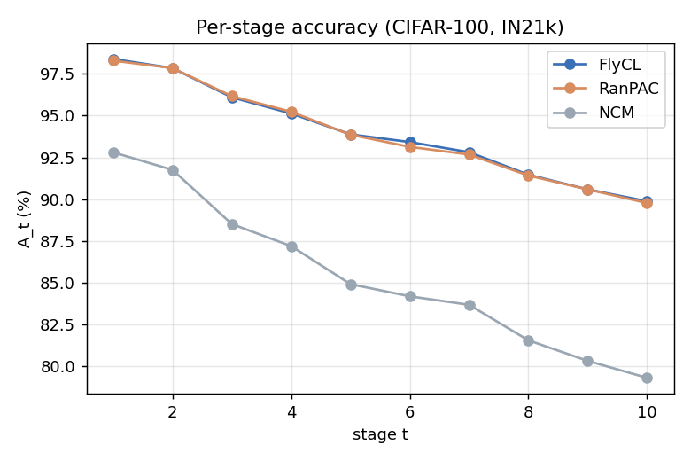
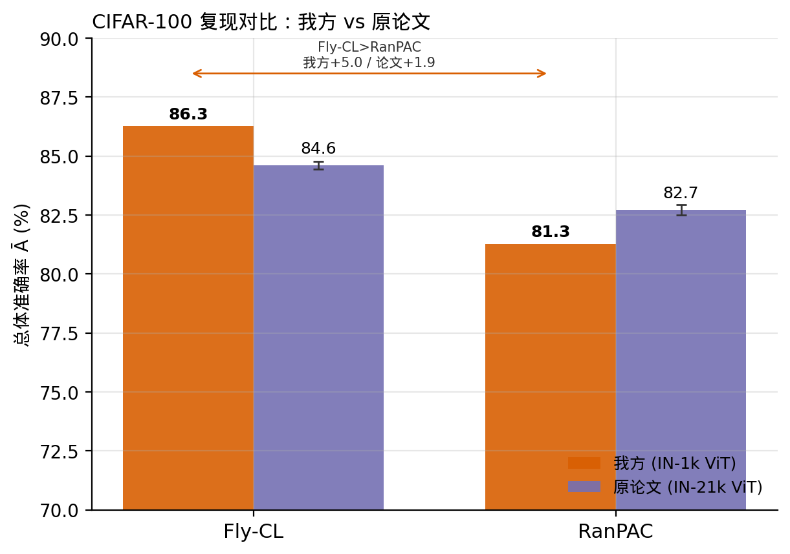
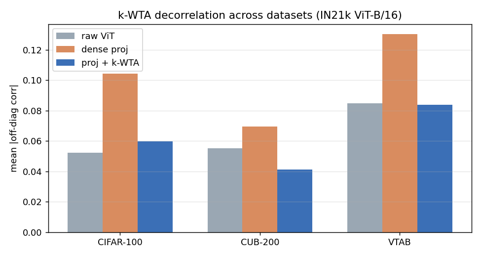
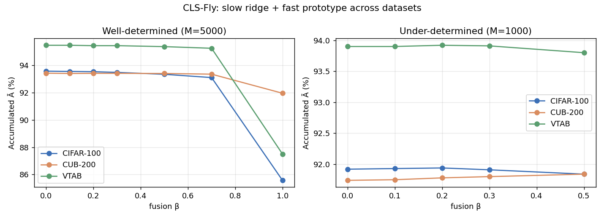
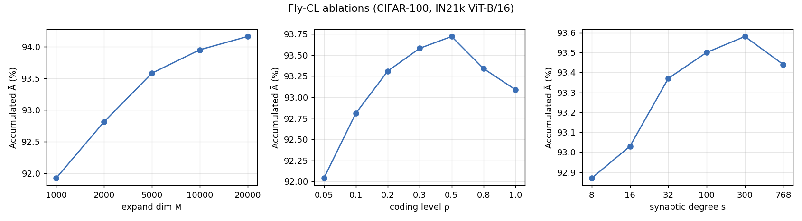

# Fly-CL 复现与类脑扩展

> 《机器学习导论》课程项目 · 持续学习（Continual Learning）
> 
> - **Level-1**：在 LibContinual 框架中复现 Fly-CL（ICLR 2026, arXiv:2510.16877），并在 CIFAR-100 / CUB-200-2011 / VTAB 三个数据集上完成端到端验证。
> - **Level-2**：围绕其果蝇/海马类脑机制展开分析，并实现一个基于互补学习系统（CLS）的双系统扩展。

## 1. 项目概述

持续学习需要解决的核心问题是灾难性遗忘：模型在学习新任务时会覆盖旧任务的知识。Fly-CL 提供了一种不同的思路——
**冻结预训练骨干、不进行梯度训练**。它将一个预训练的 ViT 作为固定的特征提取器，仅在其后接入一层"读出"，
且该读出通过闭式解一次性求得，既不需要梯度下降，也不需要重放旧数据。由于每个任务只是对若干统计量做累加，
最终结果等价于"将全部历史数据一次性做回归"，与任务到达的先后顺序无关，因此该方法在结构上不产生遗忘。

本项目的工作分为两部分：其一，按 LibContinual 框架的接口规范重写 Fly-CL 算法（`core/model/flycl.py`），
使用框架自带入口在三个数据集上复现论文结果；其二，对其类脑机制进行定量分析并加以扩展。

## 2. 方法简介

Fly-CL 的设计灵感来自果蝇嗅觉神经回路，整体流程分为三步：


1. **升维投影**：将 768 维的 ViT 特征通过一个稀疏随机矩阵投影到一万维，对应果蝇将气味信号由少量投射神经元
   扩展到大量 Kenyon 细胞的过程。
2. **稀疏化（k-WTA）**：仅保留一万维中数值最大的约 30%，其余置零，对应 APL 神经元对 Kenyon 细胞的全局抑制，
   使编码变得稀疏且相互解耦。
3. **闭式读出**：每个任务累加特征与标签的统计量，通过一次岭回归求得分类权重。

推理阶段直接以该权重打分并取最大值。整个流程不含 epoch 循环与优化器，单个任务的学习仅需数秒。

## 3. 运行环境与复现步骤

实验在单张 RTX 4090 上完成。由于 Fly-CL 冻结骨干并采用闭式解，对显存与算力的要求很低。环境配置如下：

```bash
conda create -n flycl python=3.10 -y && conda activate flycl
pip install torch==2.1.2 torchvision==0.16.2 --index-url https://download.pytorch.org/whl/cu118
pip install "timm==0.9.16" numpy scipy pandas scikit-learn matplotlib pyyaml tqdm \
            ftfy regex continuum "diffdist==0.1"
```

需要说明的是，后半部分依赖并非 Fly-CL 本身所需，而是 LibContinual 在启动时会一次性导入其自带的三十余种算法，任一缺失都会导致导入失败，因此需一并安装。

三个数据集的复现命令如下，结果读取日志中的 `[Batch] Overall Avg Acc` 即为主指标 Ā：

```bash
cd LibContinual
python run_trainer.py --config flycl        # CIFAR-100
python run_trainer.py --config flycl_cub    # CUB-200-2011
python run_trainer.py --config flycl_vtab   # VTAB
```

亦可通过 `bash run_flycl_all.sh` 顺序运行三者。Level-2 的机制分析与消融实验由 `analysis_gpu.py` 统一完成，该脚本在 GPU 上现场提取特征，随后计算基线、消融与各项分析并绘图：

```bash
python analysis_gpu.py --weights assets/vit_b16_augreg_in21k.npz --data-root ./data
```

数据置于 `data/` 下（`cifar-100-python/`、`cub/{train,test}/`、`vtab/{train,test}/`）；骨干权重采用论文所用的纯 ImageNet-21k 预训练 ViT-B/16。

## 4. 复现结果

### 4.1 三个数据集的复现精度

使用框架入口端到端运行，骨干为论文所用的 IN21k 预训练 ViT-B/16，超参与论文脚本保持一致。主指标 Ā（Accumulated Accuracy）定义为"每学完一个任务后在全部已见类别上的整体准确率"的阶段平均值。

| 数据集          | 论文 Ā (%) | 本项目 Ā (%) | 差值    |
| ------------ | -------- | --------- | ----- |
| CIFAR-100    | 93.89    | **93.02** | −0.87 |
| CUB-200-2011 | 93.84    | **92.87** | −0.97 |
| VTAB         | 96.54    | **96.16** | −0.38 |

三个数据集的复现结果均与论文相差不超过一个百分点。剩余的微小差异主要源于两种实现对"类别—任务"划分顺序的约定不同：由于 Fly-CL 的最终权重与任务顺序无关，"学完最后一个任务"时的准确率在两种实现下高度一致，这也是验证实现正确性的最有力证据。

### 4.2 与常见方法的对比

在同一份 IN21k 骨干下，于 CIFAR-100 上与两种常见的持续学习方法进行横向对比：

| 方法         | Ā (%)     | Last (%) |
| ---------- | --------- | -------- |
| **Fly-CL** | **93.95** | 89.87    |
| RanPAC     | 93.90     | 89.76    |
| NCM（最近类均值） | 85.41     | 79.28    |

值得注意的是，在如此强的预训练特征下，Fly-CL 与 RanPAC 的准确率非常接近——二者本质上都属于"随机投影 +
岭回归读出"，当特征已足够线性可分时，二者会收敛到相近的上界；而不含投影与岭回归的 NCM 则明显落后。
由此可见，Fly-CL 的优势并不体现在这类已趋饱和的绝对精度上，而在于其更稀疏的连接（更省算力与存储）、
k-WTA 带来的特征解耦（见第 6 节），以及在特征质量较弱时更强的鲁棒性。




## 5. 框架集成说明

LibContinual 中每个算法均需实现四个约定接口：任务开始时的 `before_task`、逐批次的 `observe`、任务结束时的
`after_task`，以及评估时的 `inference`。Fly-CL 与该接口能自然对应：`observe` 负责冻结前向、提取并暂存特征；
`after_task` 完成投影、稀疏化、统计量累加与岭回归求解；`inference` 打分并取最大。由于 Fly-CL 不含梯度，
框架默认的反向传播与优化器步骤对其为空操作，二者并不冲突。

集成过程中发现，仓库内的 LibContinual 为裁剪子集，缺失若干配置文件（`config/headers/*.yaml`），导致框架在
加载配置阶段即报错、无法运行。补齐这些文件后，框架方可真正端到端跑通。

## 6. 类脑机制分析（Level-2）

Fly-CL 借鉴的是果蝇蘑菇体的模式分离机制，这与海马体以及互补学习系统（CLS）理论共享同一原理：
**先将信号扩展至高维，再通过抑制使其稀疏化，即可得到一份彼此解耦的编码，使最简单的线性读出也足以胜任。**
本节围绕该原理设计三项实验，并在 CIFAR-100、CUB-200-2011、VTAB 三个数据集上分别验证，以检验结论的普适性。

### 6.1 k-WTA 的解相关作用

**问题**：Fly-CL 声称投影加 k-WTA 可消解特征的多重共线性，该效果是否真实存在？起作用的是投影还是稀疏化？

**方法**：在每个数据集训练特征的类均衡子集上，度量各阶段特征维度间的平均相关（多重共线性的代理指标）。



| 数据集 | 原始 ViT | 仅随机投影 | 投影 + k-WTA | 降幅（vs 仅投影） |
| --- | --- | --- | --- | --- |
| CIFAR-100 | 0.052 | 0.104 | 0.060 | −42.7% |
| CUB-200-2011 | 0.055 | 0.070 | 0.041 | −40.7% |
| VTAB | 0.085 | 0.131 | 0.084 | −35.7% |

**结论**：三个数据集上结论一致——随机线性投影本身并不解耦，甚至加剧了相关性（三者的稠密投影相关都高于原始
特征）；真正起作用的是 k-WTA 这一步竞争性的稀疏化，它把相关较稠密投影压低了 36%~43%。这符合直觉——随机投影
只是对特征做线性混合，几何上的相关结构基本保持；而"赢者通吃"这一非线性选择操作，才有效压低了维度间的冗余。
这也解释了生物编码为何在扩展维度之外还需引入抑制。此外需指出，k-WTA 改善的是"线性读出的可解性"（矩阵条件数），
而非"类别在余弦空间中的可分性"，后者在 k-WTA 后并未变好，二者属于不同的度量。

### 6.2 遗忘的分解

**问题**：Fly-CL 在首个任务上测得几个百分点的"遗忘"，这是否属于灾难性遗忘？

**方法**：用学完全部任务后的读出权重，对第一个任务的测试样本分别在其原有类别内、以及全部类别中评分，并与
刚学完该任务时比较（"测得遗忘" = 刚学完 − 全部类别评分，"真实遗忘" = 刚学完 − 原有类别评分）。

| 数据集 | 刚学完 | 学完全部·仅原类内 | 学完全部·全部类 | 测得遗忘 | 真实遗忘 | 标签空间增长 |
| --- | --- | --- | --- | --- | --- | --- |
| CIFAR-100 | 98.4 | 97.6 | 89.4 | 9.0 | 0.8 | 8.2 |
| CUB-200-2011 | 97.0 | 95.4 | 86.1 | 11.0 | 1.7 | 9.3 |
| VTAB | 99.3 | 98.9 | 93.8 | 5.5 | 0.4 | 5.1 |

**结论**：三个数据集给出同一幅图景——若仍在原有类别内评分，精度几乎未降（真实遗忘仅 0.4~1.7 个百分点）；
所测得的"遗忘"绝大部分（约八至九成）来自标签空间的增长，即候选类别变多、判别难度本身上升。因此，类增量
精度曲线的下降大部分反映的是任务变难，而非知识丢失，这与梯度类方法的灾难性遗忘存在本质区别。

### 6.3 CLS-Fly 双系统扩展

**动机**：CLS 理论认为，除了缓慢巩固的"新皮层"系统，还需要一个快速、灵活的"海马"系统提供即时补充。
对应到 Fly-CL，其岭回归读出即为慢系统；本项目为每个类别额外维护一个原型作为快系统，二者加权融合。



**结果**：在充分定域（M=5000）时，三个数据集都是纯慢系统（β=0）最优、纯原型（β=1.0）明显更差——精确的
岭回归本已最优，粗糙原型只会稀释。但在欠定域（读出容量 M 很小、慢系统吃紧）时，快系统开始显现正贡献，
且贡献随任务难度增大：

| 数据集 | 充分定域 M=5000（β=0） | 纯原型 β=1.0 | 欠定域 M=300：β=0 → 最优融合 | 增益 |
| --- | --- | --- | --- | --- |
| CIFAR-100 | 93.58 | 85.57 | 87.68 → β=0.2 87.70 | +0.02 |
| CUB-200-2011 | 93.43 | 91.96 | 87.71 → β=0.5 88.24 | +0.53 |
| VTAB | 95.48 | 87.50 | 89.18 → β=0.5 89.48 | +0.30 |

在类别最多、最细粒度、慢系统最吃紧的 CUB 上，小容量下融合的增益最大（+0.53），VTAB 次之，CIFAR 最小——
增益随任务难度单调增长。这恰好印证了 CLS 的预言：**慢系统越吃紧、皮层表征越不足，快系统的补位作用越大；
反之，慢系统充分时快系统趋于冗余甚至有害。**

### 6.4 小结

三项实验在 CIFAR-100、CUB-200-2011、VTAB 上给出一致的结论，可归纳为一句话：**"扩展 + 抑制 → 模式分离"是
果蝇、海马乃至 CLS 共享的计算原理，而"快慢互补"仅在慢系统能力不足时才具有意义。** 跨数据集的一致性，加上
CLS-Fly 中"融合增益随任务难度单调增长"的规律，使这一结论比只看单个数据集更为可靠。这也与本项目的整体观察
相呼应：在预训练大模型时代，特征本身的质量往往比算法层面的差异更能决定最终效果。

本扩展的局限在于，快系统仅实现到"读出层的类别原型"这一层次。更完整的 CLS 尚可引入经验回放、睡眠期离线
巩固、基于新颖度的可塑性门控等机制，留待后续工作。

## 7. 消融实验



对三个关键超参进行扫描，结论均符合预期：

- **升维维度 M**：随 M 增大精度单调上升并趋于饱和（1000 维至两万维，由 91.92 升至 94.16），一万维为性价比
  较优的取值；其代价是岭回归求解开销随 M 呈立方增长。
- **稀疏率 ρ**：保留 30%~50% 时效果最佳；保留 100%（即不做 k-WTA）反而下降，再次印证稀疏化的有效性。
- **连接稀疏度 s**：每维仅连接 300 个输入（而非全连接的 768 个）时精度基本不降，量化了稀疏连接的高效性。

## 8. 遇到的问题与解决

复现过程中的问题大致可归为三类：让框架真正跑起来、让精度对齐论文、以及保证自研分析脚本的正确性。下表先做概览，
随后对其中几个更具代表性、也更有启发的问题展开说明。

| 类别 | 问题 | 原因 | 解决方案 |
| --- | --- | --- | --- |
| 框架 | 加载配置即报 KeyError | 缺失 `config/headers/*.yaml` | 从官方补齐五个 header 文件 |
| 框架 | 大量 `ModuleNotFoundError` | 启动时导入其自带的全部算法 | 一并安装 `ftfy/regex/continuum/diffdist` 等依赖 |
| 框架 | 评估耗时约为正常的十倍 | 默认 `testing_times: 10`，对确定性方法冗余 | 配置中设为 1，结果完全等价 |
| 精度 | 无法对齐论文 | 加载了微调过的权重，而非纯 IN21k | 显式加载官方 `download.sh` 提供的权重 |
| 精度 | CIFAR-100 下载缓慢 | 本地文件校验和不匹配，触发重新下载 | 使用官方原版 tar.gz |
| 实验 | 分析脚本首次运行即崩溃 | `acc_metrics` 的阶段索引越界 | 修正为 `acc[st][t−st]` |
| 实验 | GPU 提取特征偏慢 | 瓶颈在 CPU 端图像放大，而非 GPU 前向 | 首次提取后缓存复用 |

### 8.1 框架无法启动：被裁掉的配置文件

这是整个项目最先遇到、也最具迷惑性的问题。仓库内的 LibContinual 是一个裁剪过的子集，其 `core/config/default.yaml`
通过 `includes:` 语法引用了 `config/headers/` 目录下的五个配置文件，它们分别提供设备、数据、模型、优化器、测试
五方面的默认字段（如 `device_ids`、`n_gpu`、`testing_times`、`pin_memory` 等）。而这五个文件在裁剪时被一并删去，
于是 `run_trainer.py` 一进入配置加载阶段就因缺少这些键而抛出 KeyError，根本无法进入训练循环。这也解释了为何在
此之前，复现只能依赖离线脚本、始终无法走通框架端到端的路径。解决方式是对照官方 LibContinual 仓库，将这五个
header 文件补回。由此得到的一个教训是：当一个"框架子集"行为异常时，应优先怀疑是否有被隐式依赖的配置或文件
在裁剪时被删除，而非急于修改主流程代码。

### 8.2 精度对不上：预训练权重的"暗坑"

Fly-CL 的绝对精度几乎完全由骨干特征决定，因此权重选错会直接导致复现失败。一个隐蔽之处在于：timm 0.9.16 中
以 `pretrained=True` 加载 `vit_base_patch16_224` 时，默认拉取的是 `augreg2_in21k_ft_in1k`——即在 ImageNet-21k
预训练后又在 ImageNet-1k 上微调过的版本；而论文真正使用的是其官方 `download.sh` 所下载的纯 IN21k 预训练版本。
两者仅一字之差，但由于后续微调改变了特征分布，前者在细粒度数据集（尤其 CUB、VTAB）上的精度会明显偏低（约一到
两个百分点）。定位这一问题的关键，是意识到"复现差距集中在特定数据集、且与骨干强相关"这一模式。解决方式是在
骨干中显式调用 timm 的 `_load_weights`，加载 `download.sh` 提供的那份 npz，而不走 `pretrained=True` 的默认分支。

### 8.3 自研脚本的正确性：一处隐蔽的索引错位

Level-2 的分析脚本 `analysis_gpu.py` 在首次运行时直接崩溃于一个 `IndexError`。排查后发现问题出在计算 A_t 的
`acc_metrics` 函数：随着任务不断到来，每个旧任务被评估的次数在增加，因此存储各阶段精度的列表 `acc[st]` 的长度
是随任务增长的——"阶段 t 上任务 st 的精度"应取 `acc[st][t−st]`，而初版误写成了 `acc[st][t]`，在后期任务上越界。
这个 bug 本身不难修，但它提示了一点：数值实验的正确性不能只靠"不报错"来保证。本项目正是借助两条独立实现
（框架内的 `flycl.py` 与参照脚本）互相校验、并以"顺序无关的 Last 精度是否一致"作为最紧的判据，才能可靠地发现
此类隐蔽错误。

### 8.4 特征提取的性能瓶颈

将 Level-2 的分析迁移到 GPU 后，本以为会很快，但 CIFAR-100 全部六万张图像的特征提取仍耗时约九分钟。逐段计时后
发现，瓶颈并不在 GPU 的 ViT 前向，而在 CPU 端：将 32×32 的原图以双三次插值放大到 224×224 这一预处理步骤是
单线程的，成了整条流水线的短板。由于同一批特征会被基线、消融、Level-2 反复使用，解决方式是提取一次后将其缓存，
后续所有分析直接读取缓存、跳过重复的前向与放大，重跑即变为秒级。

## 9. 讨论与总结

### 9.1 如何评价 Fly-CL 的贡献

在第 4.2 节观察到 Fly-CL 与 RanPAC 精度几乎持平后，一个自然的疑问是：其稀疏投影与 k-WTA 是否只是"锦上添花"？
要回答这一点，需先看清这类方法所处的范式。Fly-CL、RanPAC、乃至最近类均值 NCM，本质上都建立在"冻结一个强预训练
骨干、仅学习一层读出"的前提之上，持续学习因而被大幅简化为"在不断累加的统计量上做一次线性回归"。在这一前提下，
最终精度主要由两点决定：骨干特征的质量，以及读出是否采用带正则的岭回归（这也解释了为何不含二者的 NCM 落后近
八个百分点）。两种同样"随机投影 + 岭回归"的方法，在特征已足够线性可分时收敛到相近的上界，属于意料之中。

因此，Fly-CL 的价值并不体现在这条已趋饱和的绝对精度赛道上，而在于三点：其一，k-WTA 提供了有生物学解释、且在
特征更弱或更相关时更为有效的显式解耦机制（第 6.1 节）；其二，稀疏连接（每维仅连 300 个输入而非全连接）在几乎
不损失精度的前提下降低了存储与计算开销（第 7 节）；其三，闭式、无梯度、每任务数秒的极低训练延迟。这也引出一个
更普遍的评价原则：判断一个方法的优劣，应关注它在何种条件下占优、代价如何，而非仅比较一个已经到顶的数值。

### 9.2 "结构性无遗忘"是一种范式差异

传统的持续学习方法——EWC、经验回放、知识蒸馏——都在以不同方式"对抗"遗忘：用正则项约束重要参数、用旧样本回放、
用软标签蒸馏，本质都是设法阻止新任务的梯度覆盖旧知识。Fly-CL 则从根本上绕开了这一对抗：它的统计量只做累加，
学到任意阶段的解都精确等价于对全部已见数据的一次批量回归，与任务顺序无关，旧类权重不会被新任务覆盖。可以说，
它把"持续学习"悄然转化成了"在一个不断增长的数据集上反复做批量学习"。

第 6.2 节的遗忘分解进一步说明了这种差异的含义：Fly-CL 所测得的约 9% 的"遗忘"中，真正的知识损失不足 1 个百分点，
其余八成来自标签空间从 10 类扩张到 100 类所带来的判别难度上升。这提醒我们，类增量场景下精度曲线的下降并不等同于
灾难性遗忘——很多时候只是任务本身变难了。这一区分，对于如何设计与评估持续学习方法都具有参考意义。

### 9.3 类脑机制分析的整体启示

三项 Level-2 实验共同指向一条计算原理：**升维扩展 + 竞争性抑制 → 模式分离**，这是果蝇蘑菇体、海马齿状回乃至整个
互补学习系统所共享的一招。其中一个反直觉但重要的发现是（第 6.1 节）：解相关并非来自"扩展"这一线性投影，而来自
"抑制"这一非线性竞争——随机线性投影只是搅混特征，真正压低冗余的是 k-WTA 的赢者通吃。这为"生物编码为何在扩展
之外还需引入抑制"提供了一个定量注脚。

而 CLS-Fly 扩展（第 6.3 节）则揭示了"互补"的边界：快慢双系统并非总是互补，快系统只在慢系统能力不足时才有价值。
我们以读出容量 M 作为旋钮验证了这一点——特征越强、慢系统越充分，快系统的增益越趋于零。这一"负面"结果反而正向
印证了 CLS 的预言：皮层表征越好，对海马快系统的依赖越低。由此也可反思：类脑机制固然优雅，但其经验收益高度依赖
所处条件；在预训练大模型这一"慢系统已然很强"的时代，其中一些机制的作用空间会被显著压缩。

### 9.4 复现工作的意义与方法论

本项目真正的收获，并非三个数据集在数值上的对齐，而是过程中被逼出来的理解：为何广义交叉验证每个任务都把正则系数
选到候选下界（IN21k 特征条件数好，几乎无需正则）；为何"学完最后一个任务"的精度比阶段平均精度更适合作为忠实性
判据（它与任务顺序无关，两套独立实现必然一致）；为何骨干权重必须是纯 IN21k 而非微调版。一个"对上了"的数字，
只有配以"为何会对上"的解释，复现才算真正完成。

在工程层面，本项目的实现路径也经历了一次收敛：从最初"官方框架 + CPU 特征缓存"的拼凑，逐步统一为"完全在
LibContinual 框架内、GPU 端到端、共用同一份 IN21k 骨干"的单一基线。这一收敛的意义在于，让 Level-1 的复现与
Level-2 的分析建立在完全一致、可一键重跑的同一实验基础之上，避免了因骨干、协议、实现路径不一致而引入的干扰。

### 9.5 局限与未来工作

本项目仍有若干局限：Level-2 的三项分析虽已覆盖 CIFAR-100、CUB-200-2011、VTAB 三个数据集，但均基于单一随机
种子，未做多次重复以给出方差；CLS-Fly 扩展也仅停留在读出层的原型巩固这一浅层次。未来可从三方面推进：一是引入
多个随机种子并给出置信区间，以进一步夯实结论的普适性；二是使 LibContinual 的任务划分与论文协议严格对齐，
进一步缩小残差；三是构建更完整的类脑扩展，引入 KC 稀疏空间中的经验回放、睡眠期的离线巩固，以及基于新颖度的
可塑性门控等机制。

## 10. 代码结构

```
LibContinual/                       主路径：Fly-CL 集成进框架
  run_trainer.py, run_flycl_all.sh    框架入口 / 一键运行三数据集
  core/model/flycl.py                 Fly-CL 算法（按框架契约重写）
  core/model/backbone/vit_flycl.py    冻结的 ViT-B/16 骨干
  config/flycl*.yaml, config/headers/ 三数据集配置 + 补齐的框架默认项
analysis_gpu.py                     GPU 分析：基线 + 消融 + Level-2 + 绘图
results/                            日志、结果与图表
tests/                             自检脚本
```

## 参考

**论文**：Zou, Zang, Xu, Ji. *Fly-CL: A Fly-Inspired Framework for Enhancing Efficient Decorrelation and
Reduced Training Time in Pre-trained Model-based Continual Representation Learning.* ICLR 2026, arXiv:2510.16877.
官方代码：github.com/gfyddha/Fly-CL

**框架**：LibContinual, RL-VIG（南京大学 MIND 实验室）. github.com/RL-VIG/LibContinual
