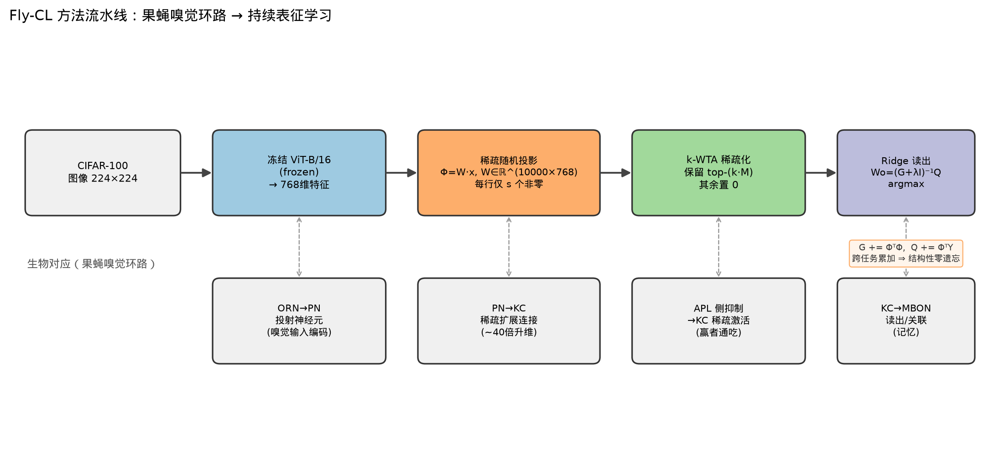

# Fly-CL 论文精读与集成映射（Level-1 选题）

> **论文**：Fly-CL: A Fly-Inspired Framework for Enhancing Efficient Decorrelation and Reduced Training
> Time in Pre-trained Model-based Continual Representation Learning
> **会议**：ICLR 2026 (accepted)｜**arXiv**：2510.16877｜**官方代码**：github.com/gfyddha/Fly-CL
> **作者**：Heming Zou, Yunliang Zang, Wutong Xu, Xiangyang Ji (Tsinghua)



## 1. 动机

在「预训练模型 + 持续表征学习」范式下，冻结骨干、把参数更新重构为**相似度匹配**（原型/线性读出）可
天然缓解灾难性遗忘。但论文指出两个痛点：

1. **多重共线性 (multicollinearity)**：直接用预训练特征做相似度匹配时，特征维度间高度相关，
   使 Gram 矩阵病态、类原型难以区分 → 相似度匹配效果差。
2. **计算开销**：更先进的解相关方法（如白化、迭代优化）对实时/低延迟场景计算过重。

Fly-CL 从**果蝇嗅觉环路**（Fig 1: Odors→ORN→PN→KC→MBON）获得灵感，用一层**稀疏随机投影 + 赢者通吃**在低时间复杂度下**渐进消解多重共线性**，从而更有效地做相似度匹配。

## 2. 算法（对应官方 main.py）

记冻结骨干输出特征 `x ∈ ℝ^d`（ViT-B/16，d=768）。超参：扩展维 `M`（=expand_dim, 如 10000）、
突触度 `s`（=synaptic_degree，每个 KC 只连 s 个 PN）、编码率 `ρ`（=coding_level，WTA 保留比例）。

**(a) 稀疏随机投影 (PN→KC)**：构造投影矩阵 `W ∈ ℝ^{M×d}`，每一行随机选 `s` 列置为
`N(0,1)` 随机权重、其余为 0（稀疏连接）。投影 `z = W x ∈ ℝ^M`（升维，M≫d）。

**(b) k-WTA 稀疏化 (APL 侧抑制)**：保留 `z` 中最大的 `k=⌈ρM⌉` 个分量、其余置 0，得稀疏码 `Φ(x) ∈ ℝ^M`：

```
values, idx = topk(z, k);  Φ = zeros_like(z);  Φ[idx] = values
```

这模拟 APL 神经元对 KC 的全局抑制，使 KC 群体呈**稀疏、去相关**的编码 → 缓解多重共线性。

**(c) 累加式 ridge 回归读出 (KC→MBON)**：对每个到达的任务 t，累加充分统计量并闭式求解：

```
Q ← Q + Φ(X_t)ᵀ Y_t            # ℝ^{M×C}   (互相关)
G ← G + Φ(X_t)ᵀ Φ(X_t)         # ℝ^{M×M}   (Gram/协方差)
λ ← GCV_select(...)            # 广义交叉验证自动选岭系数
L = cholesky(G + λI); Wo = cholesky_solve(Q, L)   # ℝ^{M×C}
```

`Y_t` 是 one-hot 标签。**推理**：`ŷ = argmax(Φ(x) Wo)`。

> **关键洞察（零遗忘的来源）**：`G, Q` 是对**已见全部数据**的充分统计量，跨任务只做加法。
> 学完任务 t 时的 `Wo` 精确等于「把 0..t 所有数据一次性拿来做 ridge 回归」的解
> 与任务到达顺序无关、与是否分任务无关。因此 Fly-CL **在结构上就没有遗忘**（recency bias=0），这与需要经验回放或蒸馏来"对抗"遗忘的方法有本质区别。

## 3. GCV 选岭（select_ridge_parameter）

对候选 `λ ∈ {10^a}`，用 SVD 一次分解后闭式算每个 λ 的广义交叉验证分数
`GCV(λ)=‖Y−Ŷ‖²/n / (1−df/n)²`，取最小者。避免了对 λ 的网格重训。

## 4. 复杂度与"训练时间少"

- 投影 + WTA：`O(N·s + N·M log k)`，无梯度、无反传。
- ridge：主成本是 `G`（M×M）的 Cholesky，`O(M³)` 一次；`G,Q` 增量累加 `O(N·M)`（或稀疏更省）。
- **无 epoch 循环、无优化器**：这是"训练时间大幅下降"的根源；论文主打的正是这一效率维度。

## 5. 官方仓库模块清单

| 文件                         | 作用                                                                           |
| -------------------------- | ---------------------------------------------------------------------------- |
| `main.py`                  | 主流程：投影矩阵构造、逐任务特征提取→投影→WTA→累加 G/Q→Cholesky 求解→评估；指标打印                         |
| `models/load_model.py`     | timm 加载 `vit_base_patch16_224`（num_classes=0）或 resnet-50                     |
| `datasets/load_dataset.py` | CIFAR-100/CUB/VTAB 的 CIL 切分与 DataLoader；变换（Resize224+CenterCrop，vit 归一化 0.5） |
| `utils.py`                 | `random_initialization`（种子）、`feature_extract`（冻结前向）、`target2onehot`          |
| `scripts/test_cifar.sh`    | CIFAR-100 超参：M=10000, s=300, ρ=0.3, seed=1993, ridge∈[6,10], data_aug=vit    |

## 6. 原始模块 → LibContinual 抽象 的映射

| Fly-CL 原始           | LibContinual 落点                     | 说明                                                     |
| ------------------- | ----------------------------------- | ------------------------------------------------------ |
| `load_model` 冻结 ViT | `backbone`（复用现成 ViT 加载器或注入缓存特征）     | 骨干冻结，`requires_grad=False`                             |
| 投影矩阵 `W` + WTA      | `classifier.FlyCL` 内部状态             | 在 `__init__` 里按种子构造稀疏 `W`；`observe/inference` 里做投影+WTA |
| `Q,G` 累加            | `FlyCL.observe(data)`               | **不反传**：把当前 batch 的 `Φᵀ`Y、`Φᵀ`Φ 累加进 `Q,G`              |
| Cholesky 求解 `Wo`    | `FlyCL.after_task()`                | 每任务末更新读出权重 `Wo`                                        |
| `argmax(Φ Wo)`      | `FlyCL.inference(data)`             | task-agnostic（类增量）                                     |
| GCV 选 λ             | `FlyCL._select_ridge()`             | 私有方法，after_task 内调用                                    |
| 类顺序切分               | `config` 的 seed + ContinualDatasets | 冻结种子对齐类顺序                                              |

> **集成策略**：Fly-CL 无梯度，与 Trainer 默认的 `loss.backward()` 循环不冲突——
> 我们让 `observe()` 返回一个 **detached 的 0 loss**（或让 Trainer 的 epoch=1、lr=0 空转），
> 真正的"学习"发生在 `observe` 的统计累加与 `after_task` 的闭式求解里。
> 为保证与框架 `_train` 的 `loss.backward()` 兼容，`observe` 返回 `loss=torch.zeros(1, requires_grad=True)`。

## 7. 保真度声明（与原论文的差异）

- **骨干预训练来源**：论文用 timm ImageNet-**21k** augreg ViT-B/16；本复现因 HF 不可达改用 torchvision
  ImageNet-**1k** 有监督 ViT-B/16。这会**系统性降低绝对精度**（21k 特征更强、更线性可分），
  但不改变 Fly-CL 相对基线的趋势与零遗忘特性。
- 其余（M, s, ρ, seed, ridge 范围、预处理）严格对齐官方 `test_cifar.sh`。
